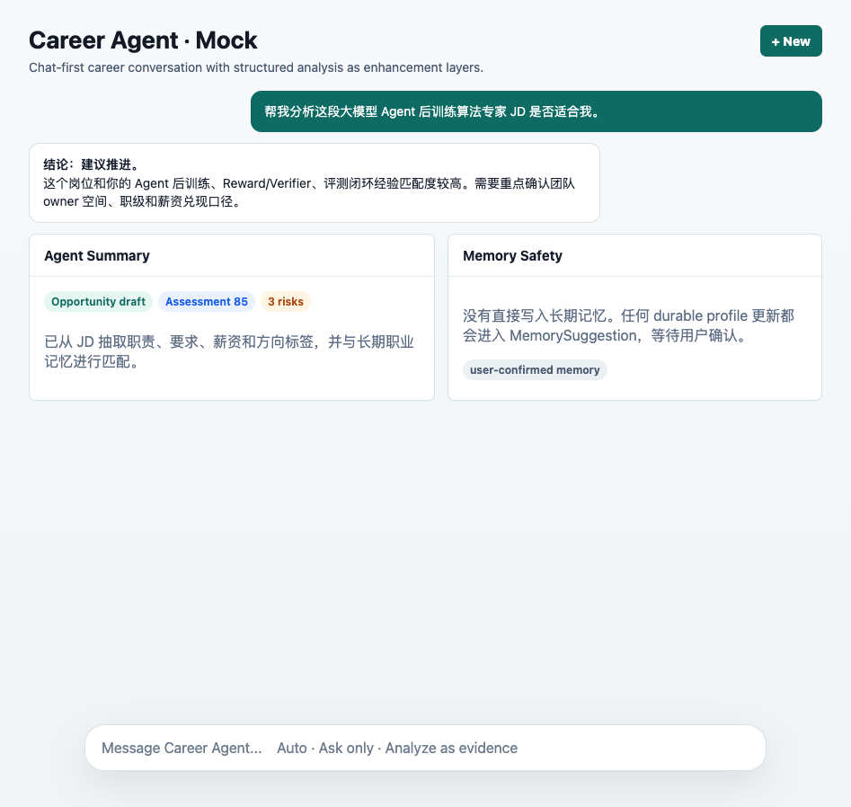
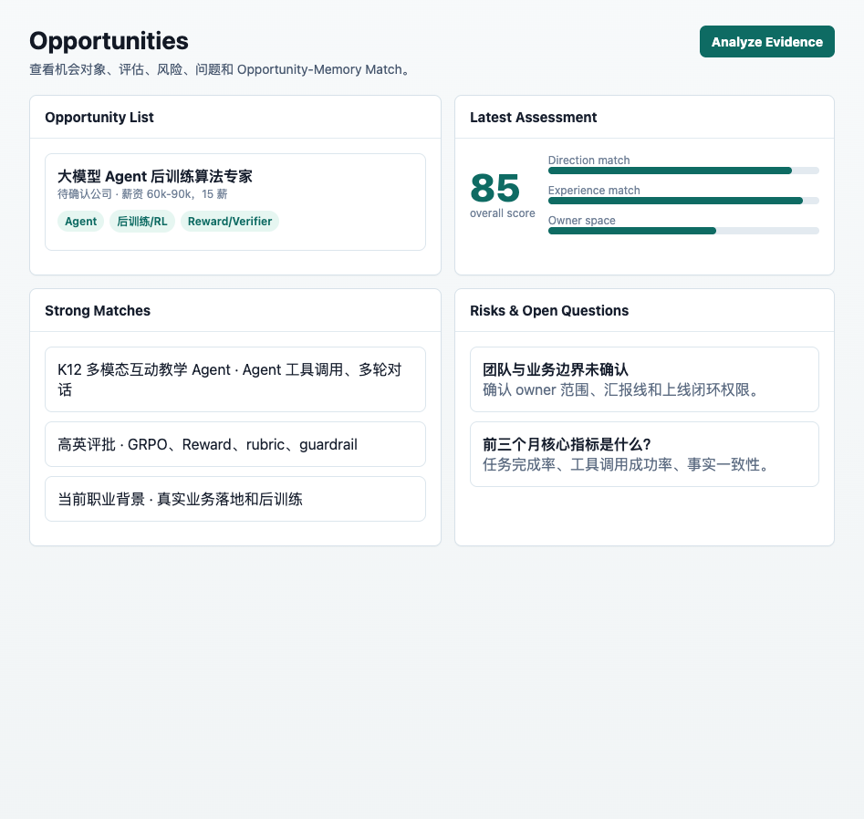
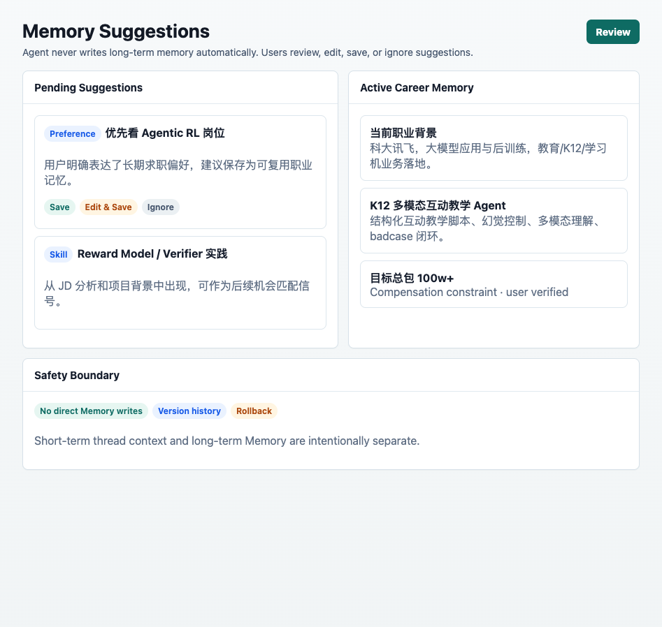
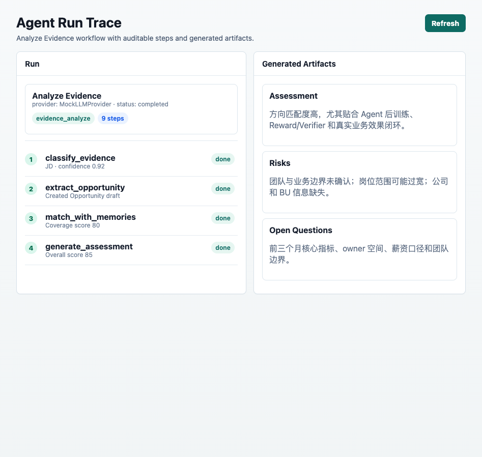

# Career Memory Agent MVP

Local-first chat-first career agent with memory and structured opportunity analysis as enhancement layers, built with Next.js, TypeScript, Tailwind CSS, SQLite, Prisma, and a provider-based LLM interface.

## Xiaomi MiMo Integration Plan

This project is applying for the Xiaomi MiMo Orbit Creator Token Program.

Career Memory Agent plans to integrate Xiaomi MiMo API as a core reasoning provider for:

- Chinese long-context career conversations
- JD structured extraction
- Opportunity assessment
- Interview preparation
- Long-term memory summarization
- Agent router classification
- Structured JSON generation
- Evaluation and benchmark comparison

MiMo will be compared with existing providers such as Mock, DeepSeek, and OpenAI-compatible models. The goal is to evaluate MiMo's performance in a real-world Chinese Agent workflow, especially for chat-first user interaction, memory safety, opportunity analysis, and structured action planning.

## Features

- Home Dashboard: stats, Pending Review Summary, recent conversations, recent runs, recent opportunities, provider/safety cards, and a Quick Start input that starts Chat execution in one click.
- ChatGPT-like Career Agent: `/chat` and `/chat/[threadId]` provide natural multi-turn conversations first, then optional memory suggestions, info gaps, structured cards, Agent Summary, pending actions, and citations.
- Memories: board/table views, search/filter, create/edit/archive/delete, Evidence ID binding, version history, rollback.
- Evidence: local evidence library for JD/recruiter/HR/interview/resume/project notes, editable original text, `Analyze with Agent`.
- Opportunities: generated opportunity profile, latest assessment, risks, open questions, decisions, and Opportunity-Memory Match View.
- Agent Runs: full router/workflow trace with all steps, generated artifacts, chat source links, and pending MemorySuggestions.
- MemorySuggestions: Agent never writes long-term memory automatically; users must Save, Edit & Save, or Ignore suggestions.
- LLM providers: `MockLLMProvider` is default and offline; `OpenAIProvider` is reserved server-side and falls back safely when `OPENAI_API_KEY` is absent.

## Screenshots

### Chat-first Career Agent



### Opportunity Analysis



### Memory Suggestions



### Agent Run Trace



## Quick Start

```bash
npm install
npx prisma migrate dev
npm run seed
npm run dev
```

Open `http://localhost:3000`.

The app uses SQLite at `prisma/dev.db`. Copy `.env.example` to `.env` if needed:

```bash
DATABASE_URL="file:./dev.db"
OPENAI_API_KEY=""
OPENAI_MODEL="gpt-4.1-mini"
```

### Xiaomi MiMo

```bash
MIMO_API_KEY=""
MIMO_BASE_URL=""
MIMO_DEFAULT_MODEL=""
```

MiMo support is planned through the existing provider interface. The same AgentRun trace, JSON validation, memory safety, and evaluation harness will be reused for MiMo.

No API key is required for the MVP. With no `OPENAI_API_KEY`, the app uses the deterministic local `MockLLMProvider`.

## Verification Script

Run the local mock workflow without opening the UI:

```bash
npm run workflow:mock
```

This analyzes the seeded JD, creates or updates an Opportunity, persists all AgentStep traces, and generates bounded Assessment/Risk/OpenQuestion/Decision records. Pending MemorySuggestions are created only when the source includes explicit durable-memory signals.

Run type checks:

```bash
npm run typecheck
```

## Career Agent Evals

The primary evaluation path uses DeepSeek Flash because it is the default real model target for this demo: fast enough for iteration, cheaper than Pro, and close to the production chat behavior the UI is meant to exercise. DeepSeek Pro remains a manual debugging option only; it is not used by the default eval loop. Mock is kept as a smoke/regression path and offline fallback, not as the quality optimization target.

Run the default real-model eval:

```bash
npm run eval:career-agent
```

Default eval config:

```json
{
  "provider": "deepseek",
  "model": "deepseek-v4-flash",
  "thinking": "disabled",
  "reasoningEffort": "none",
  "temperature": 0.2,
  "maxTokens": 2000,
  "timeoutMs": 60000,
  "stream": false
}
```

If `DEEPSEEK_API_KEY` is missing, the DeepSeek eval skips gracefully, writes a skipped report, and does not fall back to Mock. This prevents accidentally treating local deterministic output as the real-model score.

Useful commands:

```bash
npm run eval:career-agent -- --provider=deepseek-flash
npm run eval:career-agent -- --provider=mock-smoke
npm run eval:career-agent -- --case=weak_jd_should_not_create_objects
npm run eval:career-agent -- --maxCases=3
```

Cases live in `evals/career-agent/cases/` as JSON files with:

- `id`, `title`, and `provider`
- ordered chat `turns`
- hard `expectations`, such as expected `actionLevel`, expected `evidenceSufficiency`, object creation booleans, max MemorySuggestions, max risks/open questions/pending actions, `mustMention`, `mustMentionAny`, and `mustNotMention`
- optional `perTurn` expectations for multi-turn cases

The harness currently includes the main DeepSeek Flash cases: ordinary chat, weak JD, complete JD, explicit memory update, temporary thought, opportunity comparison, interview prep, external JD request, multi-turn evidence completion, Markdown/trace, follow-up context, resume/project rewriting, and interview review. Follow-up cases cover `除此之外呢`, priority sorting, entity pronouns like `它`, directional constraints like education, and next-action follow-ups after a weak JD.

Hard assertions check provider/model, object creation, Memory safety, direct Memory writes, MemorySuggestion type safety, follow-up limits, answer text constraints, AgentRun linkage, and AgentStep trace presence. Soft scoring is rule-based across answer relevance, naturalness, helpfulness, info-gap handling, memory safety, object correctness, structured enhancement, over-automation, and trace completeness. If an LLM judge is added later, it should use DeepSeek Flash and must not override hard assertions.

Failure taxonomy:

- `ERROR_OVER_AUTOMATION`
- `ERROR_MEMORY_POLLUTION`
- `ERROR_INSUFFICIENT_CLARIFICATION`
- `ERROR_TOO_MANY_FOLLOWUPS`
- `ERROR_RIGID_TEMPLATE`
- `ERROR_MISSING_ANSWER`
- `ERROR_CONTEXT_MISMATCH`
- `ERROR_MARKDOWN_RENDERING`
- `ERROR_AGENT_STATUS`
- `ERROR_TRACE_MISSING`
- `ERROR_PROVIDER_MISMATCH`

The intended optimization loop is small and case-driven: run DeepSeek Flash evals, read `evals/career-agent/report.md` and `report.json`, identify the top 1-3 failure clusters, patch prompts/router gates/post-processing only, rerun, and compare with history. Allowed fixes are limited to DeepSeek Flash prompts, classification/action-level gates, evidence sufficiency, MemorySuggestion triggers, follow-up caps, answer composition, Agent Summary skipped reasons, JSON validation, dedupe/post-processing, and the eval harness itself. Do not tune Mock output quality or make DeepSeek Pro part of the default loop.

Stop conditions:

- critical hard assertions pass for Memory safety, no direct Memory write, ordinary chat no objects, weak JD no Opportunity, full JD can create objects, AgentRun trace exists, and provider is `deepseek-v4-flash`
- overall hard assertion pass rate is at least 95%
- average soft score is at least 4.2 / 5
- Mock smoke and typecheck pass
- max 3 automatic optimization rounds
- diminishing returns after two rounds
- latency warning when average latency exceeds 15s or p95 exceeds 30s

Latency and cost controls: evals run serially by default, each turn has a 60s timeout, API failures retry at most once, timeouts are not retried, token usage is recorded when the provider returns it, and reports include average latency, p95 latency, and timeout count.

Eval DB isolation: each run copies `prisma/dev.db` into `evals/career-agent/history/eval-*.db` and points Prisma at that copy. This keeps case execution from polluting the working app database while preserving enough seeded context to test realistic behavior.

## Home Dashboard And Chat

Career Memory Agent is chat-first. The user can type freely and get a normal answer without filling a form or being forced through a structured workflow. Structured analysis, memory extraction, info gaps, citations, and audit traces are enhancement layers shown after the answer when relevant.

Chat keeps a short-term conversation context for each thread. This is separate from long-term `Memory`: short-term context is runtime thread state used to resolve the current conversation, while long-term Memory is durable user-approved knowledge. The context layer includes the recent user/assistant messages, the previous assistant answer summary, thread topic summary, active task intent, and recently mentioned companies, roles, directions, opportunities, and evidence references.

The memory layers are intentionally separate:

- Conversation Context / Short-term Memory: automatic per-thread context, recent messages, topic summary, mentioned companies/roles/directions, active task, and last assistant summary. It helps resolve follow-ups and is not written to the `Memory` table.
- Working Memory: near-term career task state such as interviews being prepared, companies being compared, this-week goals, and unresolved questions. The first implementation represents this as lightweight chat metadata or pending candidates rather than a heavy workflow queue.
- Long-term Memory: durable profile facts, skills, project claims, preferences, constraints, career goals, comparison targets, current tasks, and historical conclusions. These require `MemorySuggestion` plus user confirmation before becoming `Memory`.

Short follow-ups such as `除此之外呢？`, `还有吗？`, `展开说说`, `那这个呢？`, `刚才那个什么意思？`, `按优先级排一下`, and `那我下一步该干嘛？` are classified as `follow_up` when the thread has a usable previous assistant answer. The router records a `followUpType`, such as `ask_for_more_options`, `expand_previous_answer`, `compare_with_previous`, `ask_for_next_steps`, `ask_about_mentioned_entity`, or `clarify_previous_answer`.

Follow-up turns default to `actionLevel=answer_only`. They use the previous assistant answer and thread topic, but they do not create Evidence, Opportunity, Decision, Risk, OpenQuestion, or MemorySuggestion unless the user explicitly asks to save memory or run structured analysis.

Agent Summary exposes context debug fields for these turns: `followUpType`, `usedRecentMessagesCount`, `usedLastAssistantAnswer`, `threadTopicSummary`, and `resolvedReference`. This makes it easy to verify that `除此之外呢？` was resolved as “上一轮推荐的公司/岗位方向” instead of being handled as standalone vague chat.

The product loop is split by responsibility:

- The single global sidebar is the only navigation and recent conversation surface. It renders Home, Chat, Memories, Evidence, Opportunities, Agent Runs, pinned links, recent ChatThreads, thread-level pending badges, archive/delete actions, and Provider mode.
- Home `/` is an Agent task launcher. It keeps the large task input, starter cards, lightweight stats, and Pending Review Summary. It no longer carries the full answer/citations or primary review experience.
- Chat `/chat` and `/chat/[threadId]` are the focused conversation workspace. The main pane shows messages; the bottom composer has `Auto`, `Ask only`, and `Analyze as evidence`. Chat no longer has a second Conversations sidebar.
- The Home Quick Start input is a launcher only. If it is empty, `Start in Chat` opens `/chat/new`. If it has content, Home calls the Chat start endpoint, creates a thread, runs the same Chat send lifecycle, persists messages and AgentRun trace, then redirects to `/chat/[threadId]` with the first answer already visible.
- Home never renders the full answer/citations surface. Chat owns the conversation transcript, Agent Summary, citations, and follow-up turns.

Every Chat send still uses the existing router and workflows, but the router now makes an explicit chat-first action decision through a semantic router pipeline:

1. Save the user `ChatMessage`.
2. Read the latest 10 thread messages.
3. Retrieve relevant Memories, Opportunities, Evidence, Risks, and Decisions.
4. Build pre-router hints such as explicit memory signal, follow-up signal, evidence-like text, strong JD signal, and interview signal.
5. Call the provider-backed semantic router, usually DeepSeek Flash, for structured JSON classification.
6. Apply post-policy guardrails before any workflow can create objects.
7. Persist an `AgentRun` and `AgentStep` trace.
8. Save the assistant `ChatMessage` with `agentRunId` and metadata.

The router is model-based first, with deterministic guardrails used only for high-confidence safety boundaries and fallback. Guardrails prevent the model from writing Memory directly, creating Opportunity from weak evidence, showing JD info gaps for memory updates, or letting follow-up turns create structured objects by accident. Explicit long-term preference or constraint signals such as `以后`, `长期`, `优先看`, `不考虑`, `暂不考虑`, `目标`, `记住`, or `筛选标准` have higher priority than job-direction keywords like `Agentic RL`, `后训练`, `Reward Model`, `Verifier`, or `预训练`.

The router separates answer planning from artifact planning:

- `AnswerPlanner`: decides the conversational intent, response mode, whether context is needed, and guarantees `shouldAnswerFirst=true`.
- `ArtifactPlanner`: decides sidecar artifacts such as `memory_suggestion`, `evidence`, `opportunity`, `interview_note`, `decision`, `risk`, or `open_question`.
- `CommitPolicy`: decides write policy. Long-term Memory is always `pending_confirmation`; Evidence/Opportunity/Decision are drafts; AgentRun and thread context are `auto_low_risk` operational records.

This means a turn can naturally answer the user while separately attaching Pending Memory Updates, Job Analysis, Opportunity Draft, Interview Note Draft, Info Gaps, or Comparison cards. Artifact planning never replaces the assistant answer.

Assistant messages render their answer body with Markdown/GFM and include a separate collapsible Agent Summary with detected intent, confidence, executed actions, created objects, pending MemorySuggestion count, AgentRun link, MemorySuggestion handling link, and grouped citations.

Router metadata includes `intent`, `actionLevel`, `evidenceSufficiency`, `memorySignalStrength`, `missingFields`, `shouldCreateObjects`, `shouldSuggestMemory`, `shouldShowStructuredCard`, `shouldShowInfoGaps`, `followUpType`, `preRouterHints`, `policyGuardCorrections`, and `skippedReason`. Agent Summary surfaces these fields so router decisions and guard corrections can be inspected without exposing hidden reasoning.

`actionLevel` values:

- `answer_only`: default for normal chat, vague questions, emotional check-ins, and short questions.
- `answer_with_info_gaps`: answer what can be answered, then show a light gap hint.
- `suggest_memory_candidate`: create pending MemorySuggestions only, never durable Memory.
- `show_structured_card`: show a lightweight card after the answer, without creating formal objects.
- `propose_draft_object`: propose a lightweight working draft without forcing the user into a structured page.
- `create_structured_objects`: run the existing Evidence/Opportunity workflow when evidence is sufficient.

`create_structured_objects` is reserved for sufficiently detailed evidence, such as a complete JD with company/team, responsibilities, requirements, compensation/level, and owner-space signals. Partial JD-like text gets a preliminary natural answer plus a `Job Analysis` card and info gaps, but no formal Opportunity.

## Memory Suggestions

`MemorySuggestion` is a candidate. `Memory` is durable user-approved memory.

The system generates pending MemorySuggestions only when the user clearly states a stable preference, career goal, constraint, or asks the agent to remember something, for example:

- `以后我优先看 Agentic RL`
- `纯预训练暂时不考虑`
- `目标总包 100w+`
- `记住这个偏好`

Each turn creates at most a few candidates. Save writes a verified `Memory`; Edit & Save lets the user adjust it first; Ignore rejects the candidate. Casual chat, temporary thoughts, missing information, Risks, OpenQuestions, and Decisions are not written as long-term memory.

Supported long-term candidate types are `Preference`, `CareerGoal`, `Constraint`, `CurrentTask`, `ComparisonTarget`, `HistoricalConclusion`, `Skill`, `ProjectClaim`, and `ProfileFact`. `Risk`, `OpenQuestion`, and `Decision` are never valid MemorySuggestion types.

## Info Gaps And Cards

Info gaps are lightweight and non-blocking. The assistant answers first, then optionally shows up to a few missing fields when they materially affect the decision, such as company/team, compensation, responsibilities, requirements, or owner space.

Structured cards are enhancement layers:

- `Job Analysis Card`
- `Opportunity Comparison Card`
- `Interview Prep Card`
- `Memory Suggestions Card`
- `Info Gaps Card`

Cards never replace the assistant answer. Normal chat does not show cards. Opportunity follow-ups are limited so complete analyses do not create a flood of pending work.

Evidence and Opportunity are created only when the user provides sufficient durable evidence, such as a complete JD with responsibilities, requirements, company/team, compensation or level, and owner-space signals. Weak JD snippets, casual chat, follow-ups, resume wording, interview prep, and interview review stay in Chat unless the user explicitly asks for structured analysis or memory saving.

## Chat Markdown And Safety

Assistant `ChatMessage.content` is stored as the raw Markdown string and rendered only in the Chat UI. The renderer lives in `components/chat/MarkdownRenderer.tsx` and uses:

- `react-markdown`
- `remark-gfm`
- `rehype-sanitize`

Supported display features include headings, ordered and unordered lists, bold/italic text, inline code, fenced code blocks, GFM tables, blockquotes, and links. Tables are wrapped in a horizontal scroller so wide output does not break the transcript width. Code blocks use a light background, rounded border, padding, and a small copy button.

Safety rules:

- Raw HTML is skipped and sanitized; the app does not store or render prebuilt HTML.
- User messages remain plain text with preserved line breaks and are not passed through the Markdown renderer.
- External Markdown links open with `target="_blank"` and `rel="noopener noreferrer"`.
- Agent Summary, Pending Actions, and Citations stay outside the Markdown answer body so user-facing content and audit/status UI remain separate.

## Agent Status UI

While a Chat send is in progress, the transcript shows a lightweight `Career Agent is working...` card directly under the new user message and before the final assistant reply. The card is optimistic on the client, so it appears immediately even before the server request returns. It advances through stages such as:

- Understanding request
- Combining historical memory
- Deciding whether structured handling is needed
- Generating advice
- Calling DeepSeek
- Parsing response
- Composing answer

The server remains the source of truth for the audit trail. `sendMessage` persists the normal `AgentRun` and `AgentStep` records through `CareerAgentRouter` and the workflow. After the assistant message is saved, the message metadata includes the completed `AgentStep` list, and Agent Summary displays those real steps. The status card is replaced by the assistant message on success; on failure it marks the current step failed, restores the input, and leaves the Send button usable.

Mock also uses the same status surface. Because Mock can complete very quickly, the client keeps a short transition visible so the UI remains testable and the Agent Summary still shows the persisted steps.

Pending actions are reviewed closest to the context that generated them:

- Assistant messages can show collapsed `Pending from this response` sections below the answer: `Memory Updates (n)` and `Opportunity Follow-ups (n)`.
- `Pending Memory Updates` are `MemorySuggestion` records for long-term career memory only: profile facts, skills, projects, preferences, constraints, goals, and inferences.
- `Opportunity Follow-ups` are operational items on the opportunity itself: active `Risk` records and unanswered `OpenQuestion` records.
- Home summarizes counts and links back to Chat, Opportunities, or Agent Runs instead of rendering a large global approve/reject queue.
- Pending item metadata includes source refs where available: `sourceThreadId`, `sourceMessageId`, `sourceAgentRunId`, `sourceOpportunityId`, and `sourceEvidenceId`. These refs let the UI return to the source Chat or AgentRun for review.

## Pending Action Counts

Pending count logic lives in `lib/pending-actions/service.ts` so UI components do not each invent their own filters.

Functions:

- `getPendingActionsForThread(threadId)`: returns unresolved pending actions grouped as `memoryUpdates`, `risks`, and `openQuestions` for one thread.
- `getPendingActionsForMessage(messageId)`: returns unresolved pending actions generated by one assistant message / AgentRun.
- `getPendingCountsByThread(threadIds)`: returns batch thread-level counts for sidebar and recent conversation badges.
- `getPendingReviewSummary()`: returns Home summary counts.

Thread-level count is used by the global sidebar conversation badge, Home Pending Review Summary, and recent conversation summaries. It includes pending MemorySuggestions, active Risks, and unanswered OpenQuestions linked to that thread. It excludes accepted/rejected MemorySuggestions, resolved/dismissed Risks, answered OpenQuestions, archived threads, and deleted items.

Message-level count is used only under an assistant response. It shows pending actions from that response's AgentRun, so it can be smaller than the thread badge when a thread has multiple assistant turns.

If a historical pending item cannot be linked to a thread through Chat message metadata or AgentRun, it is treated as unlinked. Unlinked pending is not counted in any thread badge; Home can report it separately in the Pending Review Summary.

## Unified Career Agent Router

The `CareerAgentRouter` classifies the input, writes an `AgentRun`, writes `AgentStep` trace, plans actions, then calls the appropriate internal workflow. `AnalyzeEvidenceWorkflow` and `AskCareerAgentWorkflow` remain separate internal capabilities; Chat does not duplicate those workflows.

Modes:

- `Auto`: router decides whether to ask, analyze evidence, suggest memory updates, prepare interview, compare opportunities, or clarify.
- `Ask only`: forces question answering unless the input is too vague.
- `Analyze as evidence`: forces Evidence creation/reuse and the Analyze Evidence workflow.

If Auto receives vague input such as `测试 query`, `你好`, `帮我看看`, or `分析下`, it returns a clarification and does not create Evidence, Opportunity, Decision, or MemorySuggestion.

Requests that need external sources, such as `帮我找下豆包的 JD`, return `needs_external_source` and do not create objects. Paste the JD or recruiter/HR text to let the Evidence workflow run.

## Router Rules

The first MVP router uses deterministic keyword rules:

- `analyze_evidence`: long JD-like text or signals such as `岗位职责`, `任职要求`, `JD`, `薪资`, `base`, `15薪`, `GRPO`, `RLHF`, `RLVR`, `Reward Model`, `Verifier`, `Agent`, `后训练`.
- `recruiter_message` / `hr_chat`: `HR说`, `猎头`, `内推`, `面试官说`, `对方说`, `团队说`, `岗位这边`.
- `update_memory`: `以后我更想`, `以后优先`, `我更偏`, `不考虑`, `暂时不考虑`, `目标是`, `记住`, `我的偏好`.
- `prepare_interview`: `面试`, `反问`, `准备`, `追问`, `一面`, `二面`, `终面`, `交叉面`.
- `compare_opportunities`: `对比`, `哪个更好`, `A 和 B`, `vs`, `更适合`.
- `needs_external_source`: asks the agent to search/fetch external JD or recruiting source while the mock provider has no external source access.
- `clarify`: short, vague, or test-like input with insufficient context.
- Otherwise: `ask_question`.

## Ask Output

Ask answers are natural-language chat responses by default. The assistant should answer the user first, then add lightweight info gaps, structured cards, Agent Summary, pending actions, and citations only when the turn calls for them. Ordinary chat should not use a fixed analysis template or create structured objects. Analysis-oriented turns may still use concise Markdown headings, lists, and tables when they improve readability.

Vague questions return a light clarification with examples instead of a full career judgment. Requests that need external sources explain the limitation and ask the user to paste the source text.

## Project Structure

```text
app/
  chat/
  memories/
  evidence/
  opportunities/
  agent-runs/
  api/
components/
  chat/
  home/
  memory/
  evidence/
  opportunity/
  agent/
lib/
  db/
  llm/
  agent/
  career-agent/
  chat/
  command-center/
  memory/
  evidence/
  opportunity/
prisma/
  schema.prisma
  seed.ts
scripts/
  run-mock-workflow.ts
```

## Data Model

Core persisted entities:

- `Memory` and `MemoryVersion`
- `Evidence`
- `Opportunity` and `OpportunityEvidence`
- `OpportunityMemoryMatch`
- `Assessment`
- `Risk`
- `OpenQuestion`
- `Decision`
- `AgentRun` and `AgentStep`
- `MemorySuggestion`
- `ChatThread`
- `ChatMessage`
- `ChatContextAttachment`

SQLite stores array/JSON-shaped fields as JSON strings for local Prisma compatibility. Serializers in `lib/*/serializers.ts` convert them back to typed DTOs for APIs and UI.

Chat persistence:

- `ChatThread` stores the conversation title, optional summary placeholder, active/archived status, timestamps, and `lastMessageAt`.
- `ChatMessage` stores role, content, optional `agentRunId`, metadata JSON, and belongs to a thread.
- `ChatContextAttachment` stores thread-level references to Memory, Evidence, Opportunity, and AgentRun records.
- `AgentRun.chatThreadId` points back to the source thread.
- `AgentRun.sourceMessageId` points to the user message that triggered the run.
- The assistant `ChatMessage.agentRunId` points to the run produced for that answer.

## Agent Workflow

`Analyze Evidence` runs:

1. `classify_evidence`
2. `extract_opportunity`
3. `extract_role_signals`
4. `match_with_memories`
5. `generate_assessment`
6. `generate_risks`
7. `generate_open_questions`
8. `generate_decision`
9. `suggest_memory_updates`

Each step writes an `AgentStep` trace. Suggestions remain pending until the user accepts or rejects them in Agent Runs.

Unified commands add router-level trace:

- `classify_input`
- `plan_actions`
- `create_evidence` when applicable
- internal AnalyzeEvidence steps when applicable
- `retrieve_context` and `answer_question` for ask
- `suggest_memory_updates` for memory updates
- `compose_response`

Chat runs use `triggerType: "chat"` and Home Quick Start runs use `triggerType: "home_quick_start"`. Both are visible in Agent Runs. From an AgentRun, the UI shows Source, Thread title, User message, and links back to the source chat when `chatThreadId` is present.

## Chat Fixed Layout

The Chat workspace is intentionally fixed inside the remaining viewport under the top navigation:

- The app shell uses one fixed global sidebar with its own scrollable Recent section.
- The Chat pane is a column with fixed header, independently scrolling messages, and a composer pinned to the bottom of the pane.
- New messages scroll only the messages container to the bottom. Chat does not call `window.scrollTo` and should not make the whole document grow as the transcript gets longer.

This keeps global navigation, recent conversations, and the composer visible during long multi-turn sessions.

The workflow persists or updates:

- `AgentRun`
- `AgentStep` trace
- `Opportunity`
- `Assessment`
- `Risk`
- `OpenQuestion`
- `Decision`
- `MemorySuggestion`

`MemorySuggestion` is never applied automatically. Accepting a suggestion creates a verified `Memory`; rejecting it only marks the suggestion rejected.

For `update_memory`, the router only creates a pending `MemorySuggestion`. For `analyze_evidence`, the workflow may create/reuse Evidence, Opportunity, Assessment, Risk, OpenQuestion, Decision, and MemorySuggestion records. For `needs_external_source`, no structured objects are created.

## LLM Provider Boundary

The product keeps `MockLLMProvider` as the deterministic local validation path and can optionally use DeepSeek through the provider selector:

- No real API calls are made when Mock is selected.
- Mock output keeps smoke/regression cases stable for local development, but it is not the main quality optimization target.
- DeepSeek uses the OpenAI-compatible API through the official `openai` npm package.
- DeepSeek Flash is the default semantic router and eval model. DeepSeek Pro remains a manual debugging option and is not used by default evals.

Configure DeepSeek with:

```bash
DEEPSEEK_API_KEY=""
DEEPSEEK_BASE_URL="https://api.deepseek.com"
DEEPSEEK_DEFAULT_MODEL="deepseek-v4-flash"
DEEPSEEK_REASONING_MODEL="deepseek-v4-pro"
DEEPSEEK_THINKING="disabled"
DEEPSEEK_REASONING_EFFORT="high"
```

The UI exposes:

- `MockLLMProvider`
- `DeepSeek Flash`: `deepseek-v4-flash`, thinking disabled
- `DeepSeek Pro`: `deepseek-v4-pro`, thinking enabled, high reasoning effort
- `DeepSeek Pro Max Thinking`: `deepseek-v4-pro`, thinking enabled, max reasoning effort

Older manually configured model names such as `deepseek-chat` and `deepseek-reasoner` are not the default and should be treated as deprecated in the UI/docs when used.

DeepSeekProvider is wired through the existing orchestration boundary:

- Chat sends provider selection to `sendMessage`.
- `sendMessage` stores provider metadata in AgentRun input metadata.
- The existing `CareerAgentRouter` still controls intent/workflow selection.
- The existing workflow still owns database writes, validation, dedupe, and Memory safety.
- DeepSeek never writes Memory directly; it can only produce pending `MemorySuggestion` drafts.

Structured tasks use JSON output (`response_format: { type: "json_object" }`) and prompts that explicitly require valid JSON. This is used for career input classification, evidence/opportunity extraction, risks, open questions, decisions, and memory suggestions. Invalid or empty JSON is caught, recorded as a failed step/run, and surfaced in Chat without writing confirmed Memory.

DeepSeek Chat status uses the same Agent status card and AgentRun trace:

- Calling DeepSeekProvider
- Waiting for model response
- Parsing response
- Validating structured JSON
- Applying workflow rules
- Composing final answer

Provider/model metadata is recorded per run and shown in Agent Summary. When available, provider runtime metadata from workflow steps can include latency, token usage, whether `reasoning_content` existed, and an error string. If DeepSeek fails or returns invalid JSON, the run is marked failed, a failed AgentStep is recorded, Chat shows a clear assistant error, the input recovers, and structured objects are not created.

Run checks:

```bash
npm run test:deepseek
npm run typecheck
```

`npm run test:deepseek` skips gracefully when `DEEPSEEK_API_KEY` is absent. With a key, it runs basic chat and structured JSON smoke checks without writing to the app database.

Current DeepSeek limitations:

- No streaming yet.
- No tool calling.
- No external JD search.
- `reasoning_content` is not shown in the UI. The app may record `hasReasoningContent`/token metadata, but it does not display raw hidden reasoning or full chain-of-thought. The user-facing trace is limited to router decisions, workflow steps, created/skipped objects, citations, provider/model, latency, JSON parse/validation status, and concise errors.

Future streaming extensions can add SSE, WebSocket, or token streaming. The current implementation is request/response with client-side optimistic stage updates and server-side `AgentRun`/`AgentStep` audit replacement after completion.

## Chat Composer And Archive Behavior

Each `ChatThread` stores its current default model configuration:

- `provider`
- `model`
- `providerLabel`
- `thinking`
- `reasoningEffort`

`ModelProviderSelector` is thread-aware. When `/chat/:threadId` loads, the selector reads that thread's saved model config. Changing the selector inside an existing thread patches the thread and affects future sends only. Historical assistant messages and AgentRuns keep their original per-run provider metadata.

`AgentRun.input.provider` records the actual model used for each turn, including provider, model, label, thinking mode, and reasoning effort. Assistant message Agent Summary also shows the per-response model when available.

New chats use the current selector/default config when the first message creates the thread. Home Quick Start currently uses the default Mock config unless a caller passes a model config. Archived threads keep their saved model config; sending a new message to an archived thread auto-unarchives it and continues with that thread's saved model.

If a thread is set to DeepSeek but `DEEPSEEK_API_KEY` is missing, the selector can show an API-key warning, sends create a failed AgentRun with a clear assistant error, and switching back to Mock updates the thread config.

The Chat page uses one composer with two visual variants:

- `inline`: used only for an empty chat. The starter text, suggestion chips, and composer are grouped together in the center of the conversation surface so `/chat/new` feels like a ChatGPT-style start screen.
- `docked`: used after messages exist, or while a send is running. The message stream scrolls independently and the composer stays available at the bottom.

Starter chips only fill the composer draft. They do not create objects or bypass the normal `sendMessage` lifecycle.

The Chat header includes a lightweight `ModelProviderSelector`. It is currently display-only for provider choice: `MockLLMProvider` is active, while OpenAI and Local providers are marked as coming soon. The app still makes no real API calls in this mode.

Chat archive is a soft archive:

- Archive sets `ChatThread.status = archived`.
- It does not delete `ChatThread`, `ChatMessage`, `AgentRun`, pending actions, or citations.
- Recent conversations show active threads by default.
- Archived conversations are available from the sidebar `Archived` entry, which opens a lightweight archived conversations popover.
- Opening an archived chat keeps the message history visible.
- Unarchive sets `ChatThread.status = active` and returns it to Recent.
- Sending a new message to an archived thread automatically updates it back to active through the existing chat send lifecycle.

The current app still uses `MockLLMProvider`; wiring a real provider is outside this UI/archive pass.

## Memory Safety

Long-term Memory is never written automatically:

- Chat can create `MemorySuggestion` records.
- Chat assistant messages and Agent Runs are the primary manual review surfaces.
- Home is a lightweight Pending Review Summary and navigation surface.
- Processing an action in Chat updates local message state and dispatches a sidebar refresh event. The database remains the source of truth, so Home, Opportunities, and Agent Runs reflect the updated state on reload/fetch.
- Accepting a suggestion creates or updates a verified Memory.
- Rejecting a suggestion only marks it rejected.

## Idempotency And De-Dupe

Text normalization lives in `lib/utils/normalize.ts`:

- lowercase
- trim
- collapse extra whitespace
- remove common punctuation differences

Analyze Evidence de-duplication:

- Evidence is reused by normalized content from the unified input.
- Opportunity is reused by normalized `company + roleTitle`, or by the existing Evidence link.
- Risk is de-duped by `opportunityId + normalized title`; existing active risks are updated.
- OpenQuestion is de-duped by `opportunityId + normalized question`; existing unasked/asked questions are updated.
- Decision is de-duped by `opportunityId + decision`; repeated same decisions update evidence refs and `updatedAt`.
- MemorySuggestion is de-duped by `suggestedType + normalized title/content + sourceEvidenceIds`; existing pending suggestions are updated.
- Home Action Inbox also de-dupes display items before rendering.

## Pending Review Summary

Home no longer acts as a large Action Inbox. It shows aggregate pending counts, conversations needing review, and links into Chat or Opportunities. Concrete actions are reviewed closest to their source assistant message, while Agent Runs remain the audit/debug surface.

## macOS Note

If Next.js cannot load `@next/swc-darwin-*` because macOS reports an unsigned native binary, run:

```bash
codesign --force --sign - node_modules/@next/swc-darwin-x64/next-swc.darwin-x64.node
```

On Apple Silicon, replace `x64` with `arm64` if that is the installed package.

## TODO

- Add richer Evidence-to-Memory binding UI with searchable pickers.
- Add Opportunity editing and status transitions.
- Add Graph View for Memory/Evidence/Opportunity relationships.
- Add import/export and backup snapshots.
- Add stronger real OpenAI prompt/schema validation when API keys are configured.
- Add unit tests around workflow scoring and rollback behavior.
